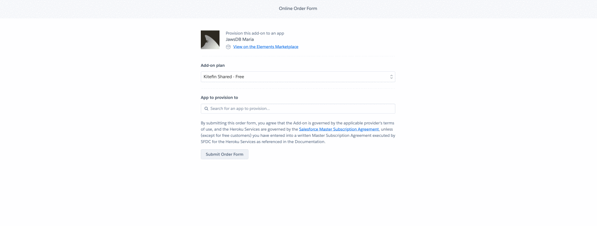
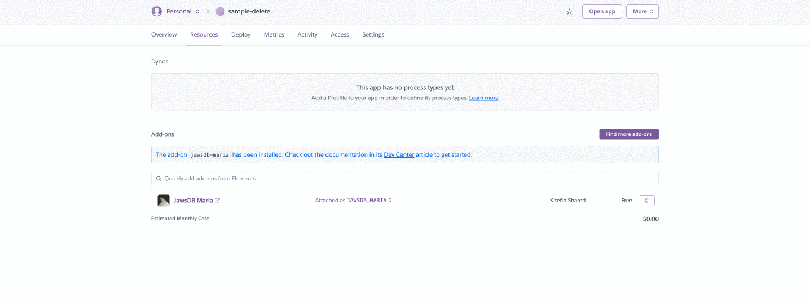

# Connecting to a SQL database from Python

## Part 1: Creating a cloud database using Heroku

1. Create an account at heroku.com
2. Login into your heroku account
3. Create a [new application](https://dashboard.heroku.com/new-app).
4. Look for application "addons" on [the Heroku Marketplace]( https://elements.heroku.com/addons), the MySQL database will be an "addon" to your application.
5. Look for the [JawDB Maria DB](./assets/jawdb.png) addon and open it by clickin on it.
6. Once you are in the [official JawDB / MariaDB addon landing page](https://elements.heroku.com/addons/jawsdb-maria), install JawDB [into your application](./assets/mariadb.png), pick the `Free plan` and search for your app.

7. Wait a couple of seconds, once is installed, go to your project resources tab and the JawDB MariaDB service should be listed there as "installed addon".

8. Click on the `JawDB Maria` addon and it will show your database credentials.
9. This is a sample on [how your database credentials will look like](./assets/JawsDB.png).


## Part 2: Understand your project template structure

Your SQL database has been created, but there are not tables yet. You are going to connect to your empty MariaDB database and create some tables from Python using SQL Scripts we have alreadly provided for you inside the `./src/sql/` folder:

- `./src/sql/create.sql` with all the tables you need to create. Hands on creating those tables.
- `./src/sql/insert.sql` with all the table values to be inserted into each table.
- `./src/sql/drop.sql` contains the SQL code to delete the tables, very usefull to clean your database.

Other important things to mention about the structure:

- Professional projects usually have a `./src` folder that contain all the "coding files" (the files that the developer will code).
- The `./assets` is irrelevant to you, it contains all the images we needed for this tutorial.
- The `root` of any professional project usally contains all the configuration files like `.gitignore`, `requirements.txt`, etc. You will learn more about this files during the rest of the project.

### Part 3: Install dependencies

There is a file in this project called `./requirements.txt` that contains the list of python libraries we will be using in this project like Pandas, PyMysql, SQLAlchemy, etc. Run the `pip install -r requirements.txt` command to install all the libraries at once.

This is possible thanks to PIP (the most popular Python package manager) and its how professionals install they project dependencies.

> NOTE: Make sure the command does not output any errors in the terminal.

### Part 4: Add your database credentials 

Create your .env file: It is a good practice that every python application must have a `.env` file, the file name starts with a `.` dot because its a configuration file that will be ignored by your Git repository. It needs to be ignored because we are going to be adding our database password inside that file. 

Type your database credentials inside the `.env` file, the file will end up looking like this:

```
DB_USER = 'hkietatgd83b4x0l'
DB_PASSWORD = 'p0s2wasdado1cr02d12'
DB_PORT = 3306
DB_HOST = 'f565gmi022AD.cbetxkdyhwsb.us-east-1.rds.amazonaws.com'
DB_NAME = 'y9uflxvx2hsf11g3f'
```

Note: Please make sure to replace this values with your real database credentials found on the JawDB Maria dashboard.

### Part 5: Start coding

All your Python code must always be inside the `src` folder, this is also another good practice.

1. The `connect` function contains the necesary code to connect to your python database, if you watch carefully you will see how it loads all the environment variables into a `connection_string` variable and then it calls the `create_engine` and `connect` fuctions.

```py
def connect():
    global engine # this allows us to use a global variable called engine
    # A "connection string" is basically a string that contains all the databse credentials together
    connection_string = f"mysql+pymysql://{os.getenv('DB_USER')}:{os.getenv('DB_PASSWORD')}@{os.getenv('DB_HOST')}/{os.getenv('DB_NAME')}?autocommit=true"
    print("Starting the connection...")
    engine = create_engine(connection_string)
    engine.connect()
    return engine
```

## 📝 Instructions

1. Let's create a file inside the `src` folder called `./src/app.py`.

> Note: This file will contain most of your application code; The database conection and the database queries.

2. Create a cloud database using Heroku as indicated in part 1.

3. In your app.py connect to your database

4. Create the tables indicated in `./src/sql/create.sql`

5. Insert the data indicated in `./src/sql/insert.sql` to your recently created tables.

6. Use pandas to print one of the tables as dataframes using read_sql function


